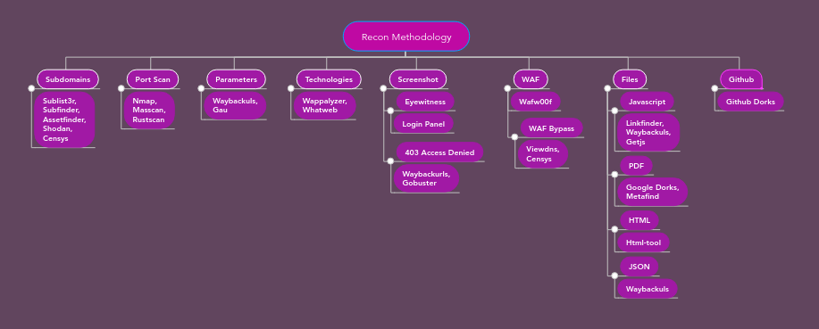

<h1 align="center">「📚」My Recon Methodology</h1>

<p align="center"></img></p>

<p align="center">Hello visitor, this repository was created to show my recon methodology that I follow to get information about a target. Hope I help you.</p>

# Cited tools:

* </p><a href="https://github.com/tomnomnom/assetfinder">Assetfinder</a></p>
* </p><a href="https://censys.io/">Censys</a></p>
* </p><a href="https://github.com/003random/getJS">GetJS</a></p>
* </p><a href="https://github.com/tomnomnom/hacks/tree/master/html-tool">HTML-Tool</a></p>
* </p><a href="https://github.com/GerbenJavado/LinkFinder">LinkFinder</a></p>
* </p><a href="https://github.com/robertdavidgraham/masscan">Masscan</a></p>
* </p><a href="https://github.com/MrEmpy/metafind">Metafind</a></p>
* </p><a href="https://github.com/nmap/nmap">Nmap</a></p>
* </p><a href="https://github.com/RustScan/RustScan">Rustscan</a></p>
* </p><a href="https://github.com/projectdiscovery/subfinder">Subfinder</a></p>
* </p><a href="https://github.com/aboul3la/Sublist3r">Sublist3r</a></p>
* </p><a href="http://viewdns.info/">ViewDNS</a></p> 
* </p><a href="https://github.com/EnableSecurity/wafw00f">Wafw00f</a></p> 
* </p><a href="https://github.com/tomnomnom/waybackurls">Waybackurls</a></p> 
* </p><a href="https://github.com/urbanadventurer/WhatWeb">WhatWeb</a></p> 
* </p><a href="https://chrome.google.com/webstore/detail/wappalyzer-technology-pro/gppongmhjkpfnbhagpmjfkannfbllamg?hl=pt-BR">Wappalyzer</a></p>

# Subdomains:

First of all I start by extracting subdomains from the target, some tools I use are ```sublist3r```, ```subfinder```, ```assetfinder```, I use shodan and censys to search more depths later to extract some information.

I have a few commands on one line to extract subdomains and check if they are alive:

```
$ cat domains.txt | assetfinder -subs-only | httpx -silent | awk -F[/:] '{print $4}' | tee -a subdomains.txt

$ sublist3r -d scope.com -o extracted_subdomains.txt;cat extracted_subdomains.txt | httpx -silent -o verified_subdomains.txt;cat verified_subdomains.txt | awk -F[/:] '{print $4}' | anew > subdomains.txt;rm verified_subdomains.txt extracted_subdomains.txt

$ subfinder -dL domains.txt -o a;cat a | httpx -silent | awk -F[/:] '{print $4}' | sort -u | tee -a subdomains.txt;rm a
```

* <a href="https://github.com/MrEmpy/BugBountyTricks">More on the subject</a>

# Port Scan:

Finding out which ports are open on a target server is one of my main tasks during reconnaissance. Tools I use to scan ports are ```nmap```, ```masscan```, ```rustscan```, I usually leave ```nmap``` for last because I prefer a faster tool like ```masscan``` and ```rustscan```. If there are many hosts I prefer to use ```masscan``` than ```rustscan```.

Some commands I use:

```
$ SCOPE=192.168.0.0/24;RPORT=22,80,443;rustscan -b 500 -a $SCOPE -p $RPORT | grep "Open $SCOPE[0-9]*" | tee -a ports.txt

$ masscan -p1-65535 -iL ips.txt --max-rate 100000 -oG ports.txt

$ nmap 192.168.0.0/24 -sV -T4 -sC
```

* <a href="https://github.com/MrEmpy/BugBountyTricks">More on the subject</a>

# Parameters:

Getting URLs with parameters is fundamental for future analysis and also automating the search for vulnerabilities in them, I usually extract them with the ```waybackurls``` tool and leave commands running in the background to find vulnerabilities such as XSS, SSRF, SQLI, Open Redirect.

Some combinations of tools I use during vulnerability analysis:

```
$ cat subdomains.txt | waybackurls | sed -e 's/:80//' | grep "?[a-z0-9]*=" | tee -a parameters.txt

$ cat parameters.txt | gf xss > xss_parameters.txt;dalfox file xss_parameters.txt --skip-bav -o dalfox.txt

$ cat parameters.txt | grep "?[a-z0-9]*=" | gf sqli | sqlmap --risk 3 --batch --dbs

$ for x in $(cat domains.txt | assetfinder -subs-only | httpx -silent);do echo "$x//<BURP SUITE COLLABORATOR OR NGROK>/%2F.." | httpx -silent -follow-redirects;done

$ cat subdomains.txt | waybackurls | gf ssrf | qsreplace <http://BURP SUITE COLLABORATOR OR NGROK> | httpx -silent -follow-redirects

$ cat subdomains.txt | waybackurls | gf redirect | qsreplace <http://BURP SUITE COLLABORATOR OR NGROK> | httpx -silent -follow-redirects
```

* <a href="https://github.com/MrEmpy/BugBountyTricks">More on the subject</a>

# Technologies:

Extracting technologies from a target is essential to know the functioning of a given target, some of these technologies had flaws found by security researchers, both critical and low level. We need to know the technologies of the target to know how to deal with that scenario of exploitation. Some tools I use are ```wappalyzer``` and ```whatweb```, I store the information for future analysis when testing the security of a target.

# Screenshot:

Screen capture helps a lot when getting to know a target's home, especially when there are many active hosts, with it I can get an idea of what each server is used and makes it easier to see what to do manually from host by host.
In the screenshots I look for hosts with login page, access denied (401/403), sites with more applications, this applies its field to select one of the hosts to start looking for vulnerabilities.

```
$ assetfinder -subs-only scope.com | httpx -silent -o verified_subdomains.txt;cat verified_subdomains.txt | awk -F[/:] '{print $4}' | anew > subdomains.txt;rm verified_subdomains.txt;eyewitness -f subdomains.txt --prepend-https -d screenshots
```

# WAF:

Some servers use Web Application Firewall (WAF) to protect their sites against malicious attacks such as code injection, it is important to identify them and know how to bypass them. I use ```wafw00f``` to identify which WAF is being used on a given host. To find the IP address of a target I usually use ```censys``` and ```viewdns```.

Some payload to bypass the WAF:

```
<sCrIpt>alert(1)</ScRipt>
<script x>
<script x>alert('XSS')<script y>
Link</a>
<script>window['alert'](document['domain'])</script>
"><svg/onload=confirm(1)>"@x.y
```

Some references on how to circumvent a WAF:

* <a href="https://hacken.io/researches-and-investigations/how-to-bypass-waf-hackenproof-cheat-sheet/">How to Bypass WAF - Cheat Sheet</a>
* <a href="https://github.com/swisskyrepo/PayloadsAllTheThings/tree/master/XSS%20Injection#filter-bypass-and-exotic-payloads">XSS bypass WAF</a>


# Files:

Some files may be interesting to get more information about the target, some scripts may contain valuable information that can trigger a failure like code injection or even disclosure of sensitive information.

Javascript files I usually use ```linkfinder```, ```waybackurls```, ```getjs``` tools to search endpoints, subdomains, sensitive information.

PDF files I use the ```metafind``` tool to find not only PDF files but also XLS, TXT, DOCX, XLSX files. A good search using Google Dorks is also effective.

HTML files I use the ```html-tools``` tool to extract parts of the HTML code like comments, endpoints, subdomains.

JSON files I use the ```waybackurls``` tool to find them and look for important information.

```
$ assetfinder -subs-only scope.com | httpx -silent | html-tool comments

$ cat subdomains.txt | waybackurls | grep "\\.json" | anew | tee -a json.txt

$ cat subdomains.txt | getJS --complete | anew | tee -a js.txt

$ metafind -d target.com -o files
```

Google Dorks:

```
site:*.scope.com ext:pdf intext:"name" intext:"email" intext:"phone" intext:"address"
site:*.scope.com ext:pdf intext:"name" intext:"email" intext:"<@domain.com>" intext:"phone" intext:"address"
site:*.scope.com ext:pdf intext:"name" intext:"email" intext:"phone" intext:"city" intext:"state" intext:"zipcode"
site:groups.google com "<TARGET>"
site:*.scope.com ext:sql
site:*.scope.com ext:env
site:*.scope.com ext:txt
site:*.scope.com ext:sql intext:"Dumping data for table `users`" | `password` | `name`
site:*.scope.com ext:txt intext:"<@domain.com>" intext:email intext:password
```

* <a href="https://github.com/MrEmpy/BugBountyTricks">More on the subject</a>

# Github:

Many companies post their projects on Github and end up letting some sensitive information leak out as an API key. For this reason, some security researchers use Github Dorks to find this information easily.

A good tool to automate this search is using the ```github-dorks``` tool.

Some dorks:

```
filename:id_rsa or filename:id_dsa
extension:sql mysql dump
extension:sql mysql dump password
filename:credentials aws_access_key_id
filename:.s3cfg
filename:wp-config.php
filename:.htpasswd
filename:.env DB_USERNAME NOT homestead
filename:.env MAIL_HOST=smtp.gmail.com
filename:.git-credentials
PT_TOKEN language:bash
filename:.bashrc password
filename:.bashrc mailchimp
filename:.bash_profile aws
rds.amazonaws.com password
extension:json api.forecast.io
extension:json mongolab.com
```

* <a href="https://github.com/techgaun/github-dorks/blob/master/github-dorks.txt">Github Dorks list</a>
